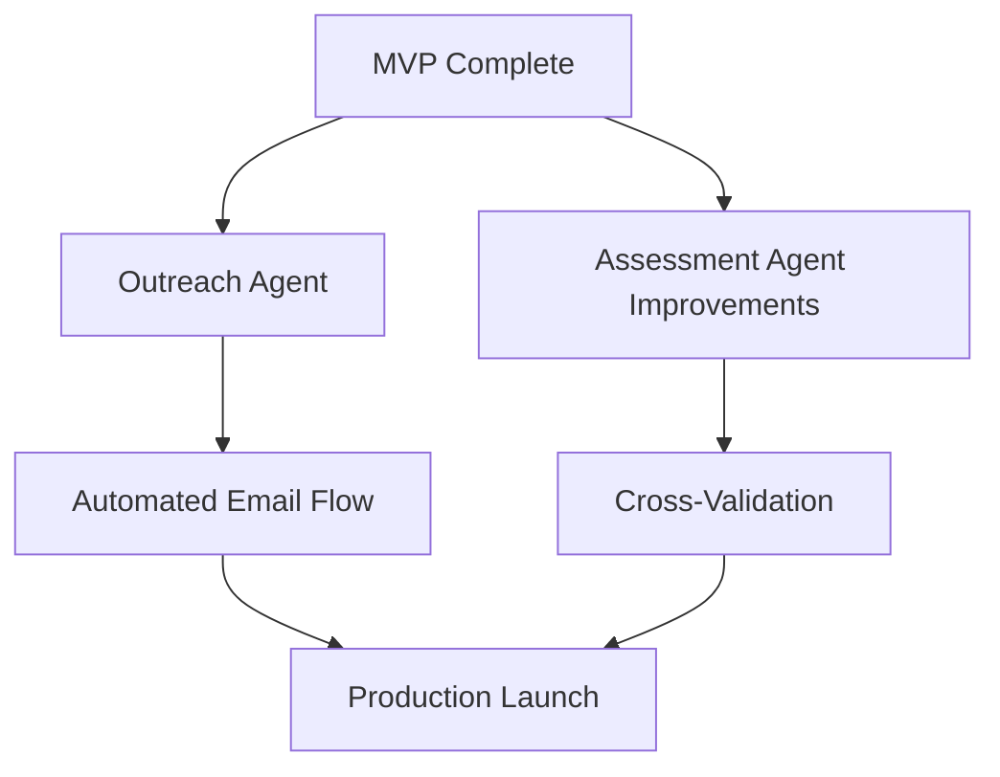

# Formly (Tax Intake Agent): Implementation Plan

**Project:** Tax Intake Agent - Automated document collection for tax accountants  
**Created:** 2026-02-07  
**Status:** In Development (MVP Complete, Agents in Progress)

---

## Executive Summary

Formly is an automated document collection system for tax accountants. Clients upload documents to cloud storage, AI classifies and validates them, and the system tracks completion against a dynamically generated checklist.

**Current State:** MVP is functional. Agent-based enhancements are in progress.

---

## Tech Stack (Established)

| Layer | Technology | Notes |
|-------|------------|-------|
| **API** | Hono.js | Fast, lightweight, runs in Node |
| **Web** | React + Vite | SPA dashboard |
| **Database** | PostgreSQL + Prisma | Single-model design with JSONB |
| **LLM** | OpenAI (gpt-4o) | Checklist generation, classification |
| **OCR** | Mistral OCR | Document text extraction |
| **Email** | Resend | Client notifications |
| **Storage** | SharePoint, Google Drive, Dropbox | Multi-provider support |
| **Intake Forms** | Typeform | Client questionnaire |
| **Hosting** | Render | Docker-based deployment |

---

## Architecture

```
┌─────────────────────────────────────────────────────────────────┐
│                         Event Triggers                           │
├─────────────────────────────────────────────────────────────────┤
│  POST /engagements       │  POST /webhooks/typeform             │
│  (new engagement)        │  (intake complete)                   │
│                          │                                       │
│  POST /cron/poll-storage     (new documents detected)           │
│  POST /cron/check-reminders  (stale engagements)                │
└─────────────────────────────────────────────────────────────────┘
                               │
                               ▼
┌─────────────────────────────────────────────────────────────────┐
│                      Processing Pipeline                         │
├───────────────┬───────────────────────┬─────────────────────────┤
│   Checklist   │   Document            │   Reconciliation        │
│   Generation  │   Classification      │                         │
│               │   + Validation        │                         │
└───────────────┴───────────────────────┴─────────────────────────┘
```

### Status Flow

```
PENDING → INTAKE_DONE → COLLECTING → READY
```

---

## Existing Feature Plans

Detailed implementation plans exist for specific features:

| Plan | File | Status |
|------|------|--------|
| Agent-Based Architecture | [2026-01-25-feat-agent-based-tax-intake-plan.md](./plans/2026-01-25-feat-agent-based-tax-intake-plan.md) | In Progress |
| Demo MVP | [2026-01-25-feat-tax-intake-agent-demo-mvp-plan.md](./plans/2026-01-25-feat-tax-intake-agent-demo-mvp-plan.md) | ✅ Complete |
| Testing Infrastructure | [2026-01-26-feat-add-testing-infrastructure-plan.md](./plans/2026-01-26-feat-add-testing-infrastructure-plan.md) | ✅ Complete |

---

## Current Priorities

### 🔥 Active Work: Agent-Based Enhancements

From `docs/plans/2026-01-25-feat-agent-based-tax-intake-plan.md`:

**Phase 1: Outreach Agent** 
- [x] Resend integration for email
- [ ] Welcome email on engagement creation
- [ ] SharePoint instructions after intake
- [ ] Reminder emails (3-day stale check)
- [ ] Issue notification emails

**Phase 2: Document Assessment Agent**
- [x] Mistral OCR integration
- [x] Document classification
- [ ] Cross-document validation
- [ ] Issue flagging workflow

**Phase 3: Reconciliation Agent**
- [x] Document-to-checklist matching
- [x] Completion percentage calculation
- [ ] Ready status determination
- [ ] Prep brief generation improvements

### 📋 Backlog

| Feature | Priority | Notes |
|---------|----------|-------|
| Client self-service portal | P1 | Let clients see their checklist status |
| Accountant dashboard improvements | P1 | Better engagement overview |
| Multi-tenant support | P2 | Multiple accounting firms |
| Dropbox deep integration | P2 | Auto-create folders |
| Audit trail | P2 | Log all LLM decisions |

---

## Task Breakdown (Current Sprint)

### P0 - Blocking

| Task | Owner | Status |
|------|-------|--------|
| Outreach Agent email templates | - | Not Started |
| Welcome email trigger on POST /engagements | - | Not Started |
| Reminder cron endpoint | - | Not Started |

### P1 - Important

| Task | Owner | Status |
|------|-------|--------|
| Improve classification confidence thresholds | - | Not Started |
| Document issue notification flow | - | Not Started |
| Client email validation | - | Not Started |

### P2 - Nice to Have

| Task | Owner | Status |
|------|-------|--------|
| Email preview in UI | - | Not Started |
| Engagement timeline view | - | Not Started |

---

## Dependencies



### External Dependencies

| Service | Status | Notes |
|---------|--------|-------|
| Resend | ✅ Configured | Domain verified |
| Mistral OCR | ✅ Configured | API key set |
| OpenAI | ✅ Configured | Using gpt-4o |
| Typeform | ✅ Configured | Webhook active |
| SharePoint | ✅ Configured | Graph API connected |
| Google Drive | ✅ Configured | Service account set |
| Dropbox | ⚠️ Optional | Partially implemented |

---

## Testing Status

From `docs/plans/2026-01-26-feat-add-testing-infrastructure-plan.md`:

| Suite | Tests | Status |
|-------|-------|--------|
| API Unit Tests | 194 | ✅ Passing |
| Web Unit Tests | 67 | ✅ Passing |
| E2E (Playwright) | - | Implemented |

```bash
# Run tests
cd apps/api && npm test
cd apps/web && npm test
cd apps/web && npx playwright test
```

---

## Deployment

**Production:** Render (via `render.yaml`)
**Branch:** `production` (NOT main)

```bash
git push origin production  # Triggers auto-deploy
```

---

## Success Metrics

| Metric | Target | Current |
|--------|--------|---------|
| Classification accuracy | > 90% | ~88% |
| Intake → Ready time | < 14 days | Measuring |
| Client response rate | > 50% | N/A (no emails yet) |
| Uptime | > 99.5% | Monitoring |

---

## Risks

| Risk | Impact | Mitigation |
|------|--------|------------|
| LLM hallucination on classification | High | Confidence thresholds, human review for low scores |
| Email deliverability | Medium | SPF/DKIM configured, monitoring bounces |
| Storage API rate limits | Medium | Delta queries, caching |
| OCR costs at scale | Medium | Cache extractions, batch processing |

---

## Next Steps

1. **Complete Outreach Agent** - Email automation is the biggest gap
2. **Tune classification thresholds** - Currently at 0.8, may need adjustment
3. **Add client-facing status page** - Let clients track their own progress
4. **Production load testing** - Ensure system handles 50+ engagements

---

*Plan consolidated by Friday 🔧 | See individual feature plans for details*
