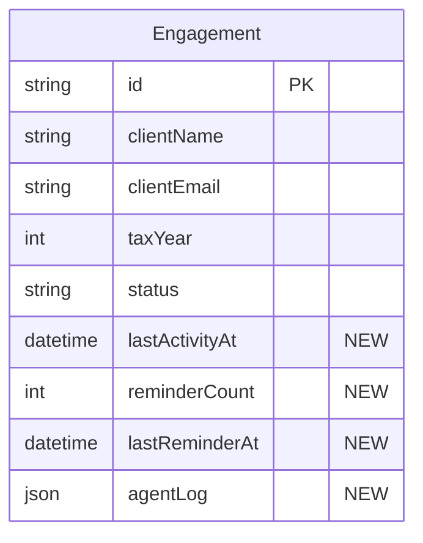

# Agent-Based Tax Intake System

## Overview

Transform the current LLM-orchestration architecture into a true agent-based system using Claude Agent SDK. Three specialized agents will handle distinct responsibilities with full autonomy:

1. **Outreach Agent** - Client communication via Resend email
2. **Document Assessment Agent** - OCR extraction and validation using Mistral OCR
3. **Reconciliation Agent** - Match documents to checklist, determine completion

Additionally, add automated welcome email flow when engagements are created.

## Problem Statement / Motivation

The current system uses direct LLM calls with no reasoning loops - just function-based orchestration. This limits:
- **Autonomous decision-making** - No ability to reason about next steps
- **Client communication** - No automated emails (client email captured but unused)
- **Document validation** - Basic classification without field extraction or cross-validation
- **Error recovery** - No retry logic or adaptive behavior

Moving to agents enables:
- Self-directed workflows that adapt to client responses
- Autonomous follow-up without human intervention
- Richer document understanding with OCR field extraction
- Better reasoning about document completeness

## Proposed Solution

### Architecture

```
┌─────────────────────────────────────────────────────────────────┐
│                         Event Triggers                           │
├─────────────────────────────────────────────────────────────────┤
│  POST /api/engagements     │  POST /api/webhooks/typeform       │
│  (engagement created)      │  (intake complete)                 │
│                            │                                     │
│  GET /api/cron/poll-sharepoint  (new documents detected)        │
│  Scheduled reminder check       (3+ days no activity)           │
└─────────────────────────────────────────────────────────────────┘
                               │
                               ▼
┌─────────────────────────────────────────────────────────────────┐
│                      Agent Dispatcher                            │
│  Routes events to appropriate agent based on trigger type        │
└─────────────────────────────────────────────────────────────────┘
         │                     │                      │
         ▼                     ▼                      ▼
┌─────────────┐      ┌──────────────────┐    ┌─────────────────┐
│  Outreach   │      │    Document      │    │  Reconciliation │
│   Agent     │      │   Assessment     │    │     Agent       │
│             │      │     Agent        │    │                 │
│ Tools:      │      │ Tools:           │    │ Tools:          │
│ • send_email│      │ • extract_ocr    │    │ • match_doc     │
│ • get_status│      │ • classify       │    │ • update_status │
│ • get_missing│     │ • validate       │    │ • calc_complete │
│ • schedule_ │      │ • extract_fields │    │ • check_ready   │
│   reminder  │      │ • cross_validate │    │ • gen_brief     │
└─────────────┘      │ • flag_issue     │    └─────────────────┘
                     └──────────────────┘
```

### Data Flow

```
PENDING ──────────────────────────────────────────────────────────►
    │
    │ [Engagement Created]
    ▼
    Outreach Agent: send welcome email with Typeform link
    │
    │ [Client completes Typeform] ──► webhook triggers
    ▼
INTAKE_DONE ──────────────────────────────────────────────────────►
    │
    │ Outreach Agent: send SharePoint upload instructions
    │
    │ [Client uploads documents] ──► cron detects new files
    ▼
COLLECTING ───────────────────────────────────────────────────────►
    │
    │ Document Assessment Agent:
    │   • Mistral OCR extraction
    │   • Classify document type
    │   • Validate (year, completeness)
    │   • Extract fields (SSN, EIN, amounts)
    │
    │ ┌── Issues found?
    │ │   YES ──► Outreach Agent: email re-upload request
    │ │          └─► await re-upload
    │ │
    │ └── NO ──► Reconciliation Agent:
    │             • Match to checklist item
    │             • Update item status
    │             • Calculate completion %
    │
    │ [Loop for each document until 100% or timeout]
    │
    │ ┌── 3+ days no activity?
    │ │   YES ──► Outreach Agent: send reminder
    │ │
    │ └── 100% complete?
    │       YES ──► Reconciliation Agent: generate brief
    │              └─► status = READY
    ▼
READY ────────────────────────────────────────────────────────────►
    │
    │ Outreach Agent: notify accountant
    │
    └──► Accountant reviews brief, files return
```

## Technical Approach

### Phase 1: Foundation (Infrastructure)

**Add dependencies:**
```bash
npm install @anthropic-ai/claude-agent-sdk resend @mistralai/mistralai
```

**Files to create:**

| File | Purpose |
|------|---------|
| `src/lib/agents/dispatcher.ts` | Route events to agents |
| `src/lib/agents/outreach.ts` | Outreach Agent definition |
| `src/lib/agents/assessment.ts` | Document Assessment Agent |
| `src/lib/agents/reconciliation.ts` | Reconciliation Agent |
| `src/lib/email.ts` | Resend email wrapper |
| `src/lib/mistral-ocr.ts` | Mistral OCR wrapper |

**Database changes:**
```prisma
model Engagement {
  // ... existing fields

  // New fields for agent tracking
  lastActivityAt     DateTime?  // Track for reminder logic
  reminderCount      Int        @default(0)
  lastReminderAt     DateTime?

  // Agent decision log (JSONB)
  agentLog           Json?      @db.JsonB
}
```

**Environment variables:**
```env
# Existing
DATABASE_URL=
OPENAI_API_KEY=

# New
ANTHROPIC_API_KEY=       # For Claude Agent SDK
RESEND_API_KEY=          # For email
MISTRAL_API_KEY=         # For OCR
EMAIL_FROM=noreply@yourdomain.com
```

### Phase 2: Outreach Agent

**Agent definition (`src/lib/agents/outreach.ts`):**

```typescript
import { createSdkMcpServer, tool } from "@anthropic-ai/claude-agent-sdk"
import { z } from "zod"
import { sendEmail } from "@/lib/email"
import { prisma } from "@/lib/prisma"

export const outreachTools = createSdkMcpServer({
  name: "outreach-agent",
  version: "1.0.0",
  tools: [
    tool(
      "send_email",
      "Send email to client",
      {
        engagementId: z.string(),
        templateType: z.enum([
          "welcome",
          "sharepoint_instructions",
          "reminder",
          "document_issue",
          "complete"
        ]),
        customMessage: z.string().optional()
      },
      async (args) => {
        // Implementation
      }
    ),
    tool(
      "get_engagement_status",
      "Get current engagement state and checklist progress",
      { engagementId: z.string() },
      async (args) => {
        // Return status, completion %, missing items
      }
    ),
    tool(
      "get_missing_documents",
      "List documents still needed from client",
      { engagementId: z.string() },
      async (args) => {
        // Return array of missing checklist items
      }
    ),
    tool(
      "schedule_reminder",
      "Schedule a follow-up reminder",
      {
        engagementId: z.string(),
        delayDays: z.number().min(1).max(14).default(3)
      },
      async (args) => {
        // Update lastActivityAt to trigger future cron
      }
    )
  ]
})
```

**Email templates (`src/lib/email.ts`):**

```typescript
import { Resend } from 'resend'

const resend = new Resend(process.env.RESEND_API_KEY)

export const emailTemplates = {
  welcome: (engagement) => ({
    subject: `Tax Document Collection - ${engagement.taxYear}`,
    html: `
      <h1>Hello ${engagement.clientName},</h1>
      <p>We're ready to collect your tax documents for ${engagement.taxYear}.</p>
      <p><strong>Step 1:</strong> Complete this intake form to help us understand what documents we'll need:</p>
      <p><a href="https://form.typeform.com/to/${engagement.typeformFormId}?engagement_id=${engagement.id}">
        Complete Intake Form
      </a></p>
      <p>After you complete the form, we'll send instructions for uploading your documents.</p>
    `
  }),

  sharepoint_instructions: (engagement) => ({
    subject: `Upload Your Documents - ${engagement.taxYear} Taxes`,
    html: `
      <h1>Time to Upload Your Documents</h1>
      <p>Based on your responses, we need the following documents:</p>
      <ul>
        ${engagement.checklist.map(item => `<li>${item.title}</li>`).join('')}
      </ul>
      <p><strong>Upload here:</strong></p>
      <p><a href="${engagement.sharepointFolderUrl}">Open SharePoint Folder</a></p>
    `
  }),

  reminder: (engagement, missingItems) => ({
    subject: `Reminder: Documents Still Needed - ${engagement.taxYear}`,
    html: `
      <h1>We're Still Missing Some Documents</h1>
      <p>We haven't received the following items:</p>
      <ul>
        ${missingItems.map(item => `<li>${item.title}</li>`).join('')}
      </ul>
      <p><a href="${engagement.sharepointFolderUrl}">Upload Now</a></p>
    `
  }),

  document_issue: (engagement, issues) => ({
    subject: `Action Needed: Document Issues - ${engagement.taxYear}`,
    html: `
      <h1>We Found Issues With Some Documents</h1>
      ${issues.map(issue => `
        <div>
          <strong>${issue.fileName}:</strong> ${issue.problem}
        </div>
      `).join('')}
      <p>Please upload corrected versions.</p>
    `
  }),

  complete: (engagement) => ({
    subject: `Documents Received - ${engagement.taxYear} Taxes`,
    html: `
      <h1>All Documents Received!</h1>
      <p>We have everything we need. Your accountant will be in touch soon.</p>
    `
  })
}

export async function sendEmail(to: string, template: { subject: string; html: string }) {
  const { data, error } = await resend.emails.send({
    from: process.env.EMAIL_FROM!,
    to,
    subject: template.subject,
    html: template.html
  })

  if (error) throw new Error(`Email failed: ${error.message}`)
  return data
}
```

### Phase 3: Document Assessment Agent

**Mistral OCR integration (`src/lib/mistral-ocr.ts`):**

```typescript
import Mistral from '@mistralai/mistralai'

const mistral = new Mistral({ apiKey: process.env.MISTRAL_API_KEY })

export async function extractDocument(documentUrl: string) {
  const response = await mistral.ocr.process({
    model: "mistral-ocr-latest",
    document: {
      type: "document_url",
      document_url: documentUrl
    },
    include_image_base64: false
  })

  return {
    pages: response.pages,
    markdown: response.pages.map(p => p.markdown).join('\n\n'),
    tables: response.pages.flatMap(p => p.tables || [])
  }
}
```

**Agent definition (`src/lib/agents/assessment.ts`):**

```typescript
export const assessmentTools = createSdkMcpServer({
  name: "assessment-agent",
  version: "1.0.0",
  tools: [
    tool(
      "extract_document",
      "Extract text and structure from document using Mistral OCR",
      {
        engagementId: z.string(),
        documentId: z.string()
      },
      async (args) => {
        // Call Mistral OCR, return structured extraction
      }
    ),
    tool(
      "classify_document",
      "Identify document type (W-2, 1099, etc.)",
      {
        content: z.string(),
        fileName: z.string()
      },
      async (args) => {
        // Use existing OpenAI classification
      }
    ),
    tool(
      "validate_document",
      "Check document for issues",
      {
        documentId: z.string(),
        content: z.string(),
        expectedTaxYear: z.number()
      },
      async (args) => {
        // Check: wrong year, missing fields, illegible
      }
    ),
    tool(
      "extract_fields",
      "Pull specific tax values from document",
      {
        documentType: z.string(),
        content: z.string()
      },
      async (args) => {
        // Extract: wages, SSN, EIN, employer name, etc.
      }
    ),
    tool(
      "cross_validate",
      "Compare extracted values across documents",
      {
        engagementId: z.string()
      },
      async (args) => {
        // Check: name consistency, income totals, etc.
      }
    ),
    tool(
      "flag_issue",
      "Mark document as having problems",
      {
        documentId: z.string(),
        issueType: z.enum(["wrong_year", "illegible", "incomplete", "duplicate"]),
        description: z.string()
      },
      async (args) => {
        // Update document record, trigger outreach
      }
    )
  ]
})
```

### Phase 4: Reconciliation Agent

**Agent definition (`src/lib/agents/reconciliation.ts`):**

```typescript
export const reconciliationTools = createSdkMcpServer({
  name: "reconciliation-agent",
  version: "1.0.0",
  tools: [
    tool(
      "match_document_to_item",
      "Link a document to a checklist item",
      {
        documentId: z.string(),
        checklistItemId: z.string(),
        confidence: z.number().min(0).max(1)
      },
      async (args) => {
        // Update document.checklistItemIds, item.documentIds
      }
    ),
    tool(
      "update_item_status",
      "Set checklist item status",
      {
        itemId: z.string(),
        status: z.enum(["pending", "received", "complete"])
      },
      async (args) => {
        // Update reconciliation.itemStatuses
      }
    ),
    tool(
      "calculate_completion",
      "Compute weighted completion percentage",
      {
        engagementId: z.string()
      },
      async (args) => {
        // high=50%, medium=35%, low=15%
      }
    ),
    tool(
      "check_ready",
      "Determine if engagement can move to READY status",
      {
        engagementId: z.string()
      },
      async (args) => {
        // Check 100% complete OR all high-priority done
      }
    ),
    tool(
      "generate_brief",
      "Create accountant prep brief",
      {
        engagementId: z.string()
      },
      async (args) => {
        // Use existing generatePrepBrief function
      }
    )
  ]
})
```

### Phase 5: Integration & API Updates

**Update engagement creation (`src/app/api/engagements/route.ts`):**

```typescript
// After creating engagement, trigger Outreach Agent
import { runOutreachAgent } from '@/lib/agents/outreach'

// In POST handler, after prisma.engagement.create:
waitUntil(runOutreachAgent({
  trigger: 'engagement_created',
  engagementId: engagement.id
}))
```

**Update Typeform webhook (`src/app/api/webhooks/typeform/route.ts`):**

```typescript
// After checklist generation, trigger Outreach Agent
waitUntil(runOutreachAgent({
  trigger: 'intake_complete',
  engagementId
}))
```

**Update SharePoint cron (`src/app/api/cron/poll-sharepoint/route.ts`):**

```typescript
// Replace inline classification with Assessment Agent
import { runAssessmentAgent } from '@/lib/agents/assessment'

// For each new file:
await runAssessmentAgent({
  trigger: 'document_uploaded',
  engagementId,
  documentId: newDoc.id
})
```

**Add reminder cron (`src/app/api/cron/check-reminders/route.ts`):**

```typescript
export async function GET(request: NextRequest) {
  // Auth check...

  // Find engagements needing reminders
  const staleEngagements = await prisma.engagement.findMany({
    where: {
      status: { in: ['INTAKE_DONE', 'COLLECTING'] },
      lastActivityAt: { lt: subDays(new Date(), 3) },
      reminderCount: { lt: 5 }  // Max 5 reminders
    }
  })

  for (const engagement of staleEngagements) {
    waitUntil(runOutreachAgent({
      trigger: 'stale_engagement',
      engagementId: engagement.id
    }))
  }

  return NextResponse.json({ checked: staleEngagements.length })
}
```

**Update vercel.json:**

```json
{
  "crons": [
    {
      "path": "/api/cron/poll-sharepoint",
      "schedule": "*/5 * * * *"
    },
    {
      "path": "/api/cron/check-reminders",
      "schedule": "0 9 * * *"
    }
  ]
}
```

## Acceptance Criteria

### Functional Requirements

- [ ] Welcome email sent automatically when engagement created
- [ ] SharePoint instructions sent after Typeform completion
- [ ] Documents processed with Mistral OCR for text extraction
- [ ] Document issues trigger email to client requesting re-upload
- [ ] Reminder emails sent after 3 days of inactivity (max 5 reminders)
- [ ] Accountant notified when engagement reaches READY status
- [ ] All emails use professional templates with engagement context

### Non-Functional Requirements

- [ ] Agent decisions logged to `agentLog` field for audit
- [ ] Email send failures retry up to 3 times
- [ ] OCR failures fall back to basic text extraction
- [ ] No more than 1 email per document issue (batch issues)
- [ ] Reminder check runs daily at 9 AM UTC

### Quality Gates

- [ ] All agent tools have Zod input validation
- [ ] Email templates render correctly (test with Resend preview)
- [ ] OCR extraction handles PDF and image formats
- [ ] Existing tests continue to pass

## Success Metrics

| Metric | Target |
|--------|--------|
| Time from engagement creation to first client email | < 1 minute |
| Document classification accuracy | > 90% |
| Client response rate after reminder | > 50% |
| Average days to READY status | < 14 days |

## Dependencies & Prerequisites

| Dependency | Status | Notes |
|------------|--------|-------|
| Anthropic API key | Required | For Claude Agent SDK |
| Resend account + domain verified | Required | For email sending |
| Mistral API key | Required | For OCR |
| Current system working | ✅ Done | MVP is functional |

## Risk Analysis & Mitigation

| Risk | Impact | Mitigation |
|------|--------|------------|
| Agent SDK learning curve | Medium | Start with Outreach Agent (simplest), iterate |
| Email deliverability | High | Verify domain, set up SPF/DKIM, monitor bounces |
| Mistral OCR costs | Medium | Cache extractions, batch where possible |
| Rate limits (any API) | Medium | Implement exponential backoff, queue requests |
| Client spam complaints | High | Honor unsubscribes, cap reminders at 5 |

## ERD Changes



## References & Research

### Internal References
- Brainstorm: `docs/brainstorms/2026-01-25-agent-architecture-brainstorm.md`
- Current LLM functions: `src/lib/openai.ts`
- SharePoint integration: `src/lib/sharepoint.ts`

### External References
- [Claude Agent SDK TypeScript](https://github.com/anthropics/claude-agent-sdk-typescript)
- [Resend Node.js SDK](https://github.com/resend/resend-node)
- [Mistral OCR Documentation](https://docs.mistral.ai/capabilities/document_ai/basic_ocr)
- [Mistral OCR 3 Announcement](https://mistral.ai/news/mistral-ocr-3)

### Open Questions (from SpecFlow analysis)

1. **Concurrent uploads** - If client uploads 10 documents at once, process in parallel or sequential?
   - *Recommendation:* Sequential to avoid race conditions on reconciliation

2. **Re-upload handling** - Does re-upload replace old document or create new version?
   - *Recommendation:* Replace (mark old as superseded)

3. **Classification confidence threshold** - When to auto-accept vs flag for review?
   - *Recommendation:* 0.85 threshold, below = flag

4. **Accountant notifications** - Only on complete, or also for issues?
   - *Recommendation:* Start with complete only, add issue alerts in v2
